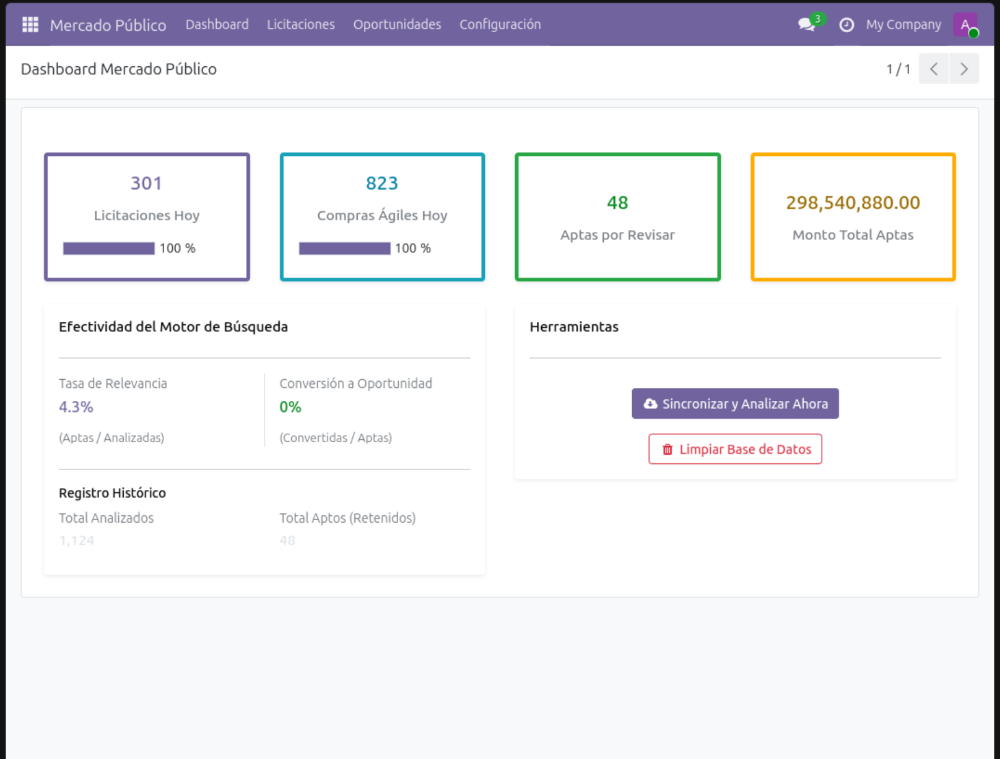
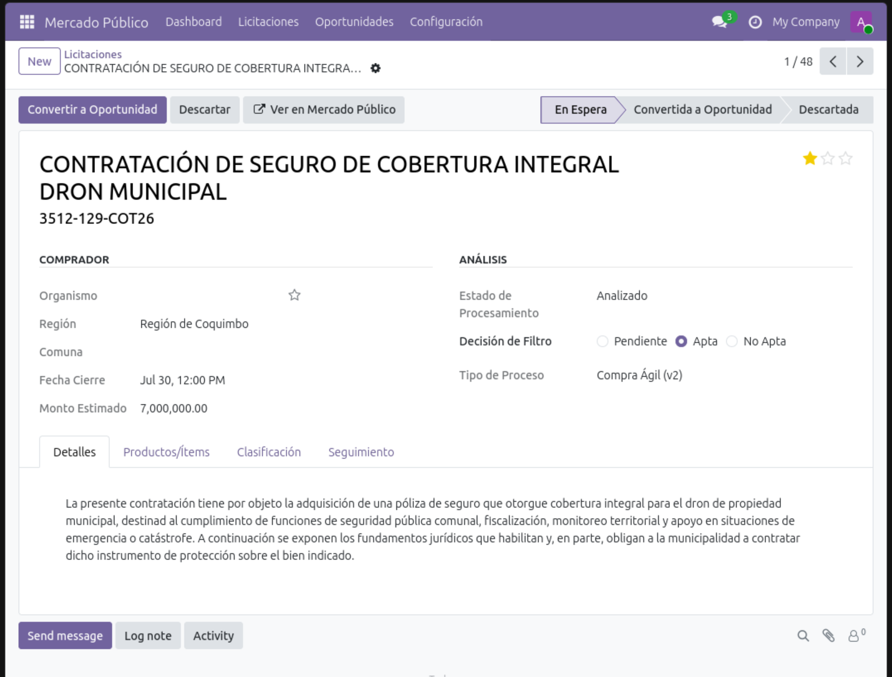
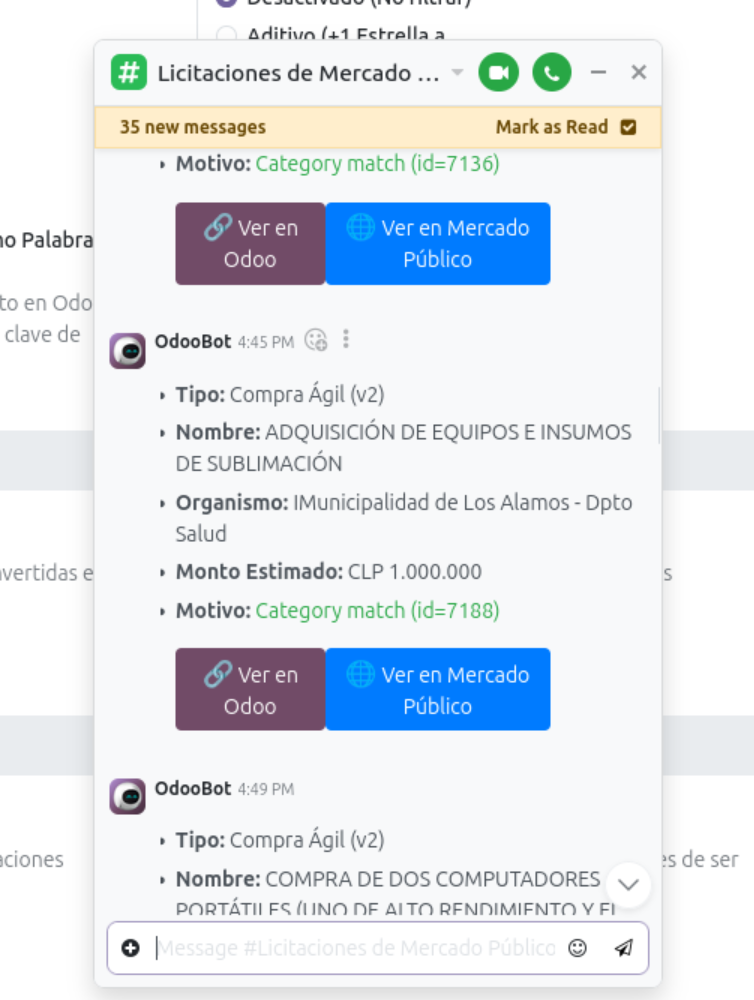

# Integración Mercado Público & Compras Ágiles para Odoo

[](https://www.odoo.com/)
[](LICENSE)
[](https://api.mercadopublico.cl)

Solución nativa para conectar **Odoo 19** con la plataforma de compras públicas de Chile (**ChileCompra / Mercado Público**). 

Diseñada para automatizar la captura de oportunidades de negocio en **Licitaciones Públicas** y **Compras Ágiles**, pre-filtrando solicitudes irrelevantes y convirtiendo las oportunidades viables directamente en tu flujo comercial de Odoo CRM.



---

## 🎯 ¿Por qué usar este módulo?

Para las empresas que venden al Estado de Chile, revisar manualmente la plataforma de Mercado Público genera cientos de horas de trabajo repetitivo. Este módulo actúa como un asistente comercial automatizado dentro de Odoo:

* **Captura Automática:** Revisa periódicamente las licitaciones públicas y solicitudes de compra directa sin requerir búsquedas manuales.
* **Filtro Inteligente:** Ignora compras de rubros o regiones donde tu empresa no participa, mostrando solo las oportunidades que se ajustan a tu catálogo y alcance comercial.
* **Integración Comercial Directa:** Permite evaluar oportunidades en Odoo y transformarlas en Leads o Cotizaciones del CRM con un solo clic.
* **Alertas para el Equipo:** Notifica a tu equipo de ventas a través de canales de Odoo Discuss sobre nuevas licitaciones relevantes en tiempo real.

---

## 🚀 Funcionalidades Principales

### 1. Sincronización Automática Dual (API v1 y v2)
* **Licitaciones Públicas (v1):** Descarga programada nocturna de licitaciones públicas emitidas en la jornada.
* **Compras Ágiles (v2):** Captura continua de procesos de compra directa de menor tamaño con sincronización temporal por zona horaria.
* **Protección de Cuota API:** Gestión inteligente para evitar bloqueos por exceder los límites diarios de consultas HTTP.

### 2. Motor de Filtrado Comercial y Vista Detallada
* **Comparación Textual Fonética (`thefuzz`):** Previene la pérdida de oportunidades por diferencias tipográficas, plurales o errores en las publicaciones del comprador.
* **Categorías UNSPSC:** Clasificación según el árbol oficial de categorías de productos y servicios.
* **Filtros Geográficos y Compradores:** Posibilidad de delimitar búsquedas por regiones de Chile o priorizar organismos compradores específicos.



### 3. Flujo Comercial en Odoo CRM y Notificaciones Discuss
* **Conversión a Oportunidad en 1-Clic:** Generación automática de un registro CRM pre-llenado con presupuesto estimado, cliente comprador, fecha de cierre y enlace directo al portal oficial.
* **Tablero Kanban:** Gestión independiente de estados (*En Espera*, *Convertida*, *Descartada*) para evaluar licitaciones antes de pasarlas al embudo comercial principal.
* **Notificaciones en Discuss:** Envío de tarjetas interactivas y resúmenes estructurados al canal dedicado `#Mercado Público`.



---

## 🛠️ Requisitos del Sistema y Configuración del Servidor

### 1. Dependencias de Python
Instale los paquetes requeridos en el entorno virtual de Odoo (`venv`):

```bash
pip install thefuzz requests pytz
```

### 2. Configuración Mínima Sugerida en `odoo.conf`

Para garantizar que las tareas de sincronización masiva se ejecuten adecuadamente sin interrumpirse por tiempos límite de servidor, se sugiere contar con los siguientes parámetros mínimos en la configuración de Odoo:

```ini
[options]
; Habilitar hilos para ejecución de tareas automáticas (Cron)
max_cron_threads = 2

; Tiempos límite de ejecución para procesos en background
limit_time_cpu = 600
limit_time_real = 1200
```

---

## 📋 Guía de Inicio Rápido (Onboarding)

Al instalar el módulo, el sistema desplegará un **Asistente de Configuración Inicial**:

1. **Clave de API:** Ingrese su ticket de la API oficial (obtenible gratuitamente en [api.mercadopublico.cl](https://api.mercadopublico.cl)).
2. **Parámetros de Sincronización:** Seleccione si desea importar Licitaciones Públicas, Compras Ágiles o ambas.
3. **Filtros Iniciales:** Defina las palabras clave de su negocio y las categorías UNSPSC objetivo.
4. **Asignación Comercial:** Seleccione el Equipo de Ventas y el Vendedor responsable predeterminado para las nuevas oportunidades.

*Estos ajustes se pueden modificar en cualquier momento desde **Ajustes > Mercado Público**.*

---

## ⏰ Tareas Programadas (Cron Jobs)

El módulo opera automáticamente a través de los siguientes trabajos programados:

| Trabajo Automático | Frecuencia | Propósito |
|---|---|---|
| **Importar Licitaciones (v1 Nocturno)** | Diaria (23:00) | Descarga las licitaciones públicas del día. |
| **Importar Compras Ágiles (v2)** | Cada 60 min | Consulta la ventana temporal de compras ágiles recientes. |
| **Analizar Licitaciones Nuevas** | Cada 2 min | Procesa los lotes importados aplicando las reglas de filtrado. |
| **Actualizar Estado Licitaciones** | Cada 2 horas | Sincroniza cambios de estado en licitaciones vigentes. |
| **Limpieza Automática** | Diaria (03:00) | Purga registros descartados según el periodo de retención configurado. |

---

## 🏗️ Estructura del Módulo

```text
mercadopublico_odoo_integration/
├── data/                       # Datasets XML (UNSPSC, Ubicaciones Chile, Crons, Acciones)
├── models/                     # Modelos ORM y lógica de procesamiento
│   ├── services/               # Clientes API, mapeadores de datos y scoring
│   ├── mercadopublico_api.py   # Fachada de conexión API
│   ├── mercadopublico_tender.py# Modelo principal de Licitaciones y Compras Ágiles
│   └── crm_lead.py             # Integración nativa con CRM Lead
├── security/                   # Reglas de seguridad y accesos (ACL)
├── static/                     # Recursos web (widgets, estilos y capturas)
│   └── description/screenshots/# Capturas de pantalla para documentación
├── views/                      # Vistas XML (Formularios, Listas, Kanban, Dashboard)
└── wizards/                    # Asistentes interactivos (Onboarding, Feedback, Descarte)
```

---

## 📄 Licencia y Compatibilidad

* **Compatibilidad:** Odoo 19.0 (Community & Enterprise)
* **Licencia:** GNU Lesser General Public License v3.0 ([LGPL-3](LICENSE))
